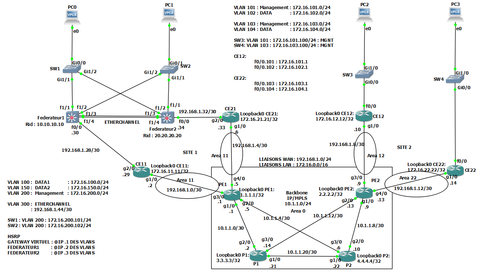

# ProjetSecuriteDesReseaux

## IMAGES IOS UTILISEES

**Routeurs** :

- CE11, CE21, CE12, CE22, PE1, PE2, P1 et P2: c7200-adventerprisek9-mz.152-4.M7.image

**Switchs**:

- L3 Switchs: Federateur1, Federateur2: (EtherSwitch) c3745-adventerprisek9-mz123-26.image
- L2 Switchs: SW1, SW2, SW3, SW4: Nous avons utilisé QEMU vios_l2-adventerprisek9-m.03.2017.qcow2

**PCs**:

- PC0, PC1, PC2, PC3: VPCs GNS3

## CONFIGURATION ASA

**ACCESS LIST OUTSIDE-INSIDE** :

- access-list OUTSIDE-IN extended permit ip any any
- access-list OUTSIDE-IN extended permit ip any any echo-reply
- access-group OUTSIDE-IN in interface OUTSIDE

**ACCESS LIST DMZ-INSIDE** :

- access-list DMZ-IN extended permit icmp any any
- access-list DMZ-IN extended permit icmp any any echo-reply
- access-group DMZ-IN in interface DMZ

activation-key 0xb23bcf4a 0x1c713b4f 0x7d53bcbc 0xc4f8d09c 0x0e24c6b6

## CONFIGURATION CLIENT RADIUS

- conf t
- aaa new-model
- aaa authentication login default group radius
- radius-server host 192.168.20.201 auth-port 1812 acct-port 1813 key tekup

**OU**:

- aaa new-model
- aaa group server radius ADM_RADIUS
- server-private IP_SRV_RADIUS key 0 votre_clé_radius_en_clair
- aaa authentication login default local group ADM_RADIUS
- aaa authorization exec default local group ADM_RADIUS

## CONFIGURATION CLIENT SNMP

- conf t
- snmp-server community private RW
- snmp-server host 192.168.20.201 version 2c private udp-port 161
- snmp-server enable traps entity-sensor threshold

**Test SNMP**:

- snmpwalk -v 2c -c private @IPhost

## CONFIGURATION SERVEUR RADIUS DANS CentOS

(Les serveurs doivent etre placer dans un reseau cree )

- yum update
- yum install freeradius freeradius-utils freeradius-mysql freeradius-perl -y

**Generation des clefs** :

- cd  /etc/raddb/certs
- ./bootstrap

- systemctl status radiusd
- systemctl enable --now radiusd

**Firewall** :

- sudo firewall-cmd --add-service={http,https,radius} --permanent
- sudo firewall-cmd --reload

**Config check with debugging** :

- /usr/sbin/radiusd -C -lstdout -xxx

**Ajouter un utilisateur dans clients.conf et son mot de passe dans users** :

- cd /etc/raddb/
- vim clients.conf

**Dans le fichier clients.conf, mettre le contenu suivant** :

	client username {
	    secret = valeur_du_secret
	    ipaddr = valeur_de_l'IPv4
	}

**Dans le fichier users, mettre son mot de passe** :

- username Cleartext-Password := "Valeur_du_password"

systemctl restart radiusd

**Test dans le serveur radius** :

- radtest  \<user>  \<password>  <Radius_server_IP>  <NAS_port> \<Secret>

**Exemple** : radtest leo pass 127.0.0.1 0 secret

## CONFIGURATION NAGIOS DANS CentOS

**Installation des packages** :

- yum install -y httpd httpd-tools php gcc glibc glibc-common gd gd-devel make net-snmp

**Creation utilisateurs et groupes pour nagios** :

- useradd nagios
- groupadd nagcmd

**Paramatres des droits de groupe** :

- usermod -G nagcmd nagios
- usermod -G nagcmd apache

**creation du repertoire pour l'installation de Nagios** :

- mkdir /root/nagios
- cd /root/nagios

**Telechargement de l'archive Nagios et ses plugins** :

- wget <https://assets.nagios.com/downloads/nagioscore/releases/nagios-4.4.6.tar.gz>;
- wget <https://nagios-plugins.org/download/nagios-plugins-2.2.1.tar.gz>;

**Decompresser** :

- tar -xvf nagios-4.4.6.tar.gz
- tar -xvf nagios-plugins-2.2.1.tar.gz

**Se deplacer dans le repertoire** :

- cd nagios-4.4.6/

**Demarrer la configuration** :

- ./configure --with-command-group=nagcmd

**Compilation et installation** :

- make all
- make install
- make install-init
- make install-commandmode
- make install-config

**Installer l'interface web** :

- make install-webconf

**Creer un mot de passe pour l'interface web** :

- htpasswd -s -c /usr/local/nagios/etc/htpasswd.users nagiosadmin

**Demarer le service httpd** :

- systemctl start httpd.service

**Reglage du pare-feu** :

- firewall-cmd --zone=public --add-port=80/tcp --permanent
- firewall-cmd --reload

**Installation des plugins** :

- cd /root/nagios
- cd nagios-plugins-2.2.1/

**Installation** :

- ./configure --with-nagios-user=nagios --with-nagios-group=nagios

**Compilation et installation** :

- make all
- make install

**Verification** :

- /usr/local/nagios/bin/nagios -v /usr/local/nagios/etc/nagios.cfg

**Ajustement du selinux** :

- getenforce
- setenforce 0

**Ajustement des services** :

- systemctl enable nagios
- systemctl enable httpd

**Fichier de configuration Nagios** :

- /usr/local/nagios/etc/cgi.cfg

## QUELQUES LIENS

- MySql: <https://unixcop.com/how-to-install-mysql-on-centos-9-stream/>
- Zabbix: <https://www.zabbix.com/download?zabbix=6.4&os_distribution=centos&os_version=9&components=server_frontend_agent&db=mysql&ws=apache>
